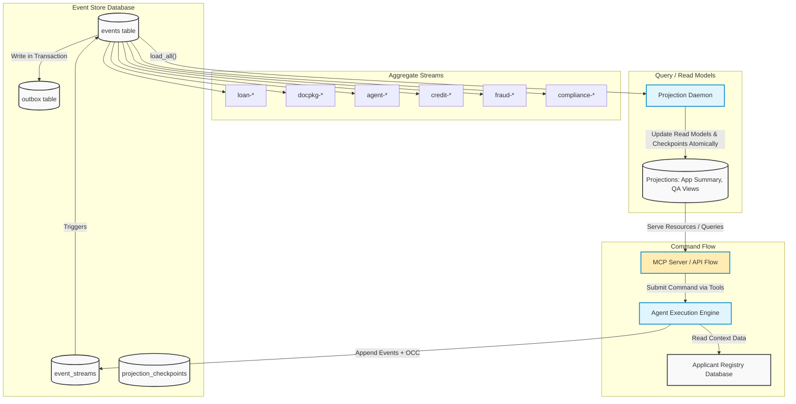

# Final Consolidated Report: The Ledger

## Executive Summary

This final submission consolidates and finalizes the interim report for The Ledger, an event-sourced, audit-first, agentic loan decision platform.

Since the interim checkpoint, the system moved from strong write-side fundamentals to end-to-end demonstrability across the required rubric. The final state includes:
- Proven optimistic concurrency control (OCC) behavior with deterministic conflict handling.
- Event-stream replay and historical decision traceability.
- Temporal compliance snapshots and point-in-time reconstruction.
- Upcasting support with immutable stored history.
- Crash/recovery reconstruction flows.
- Counterfactual what-if analysis endpoints and orchestration.
- Real generated document ingestion in UI-driven pipeline runs.
- Expanded registry diversity for realistic applicant variation.

The implementation remains grounded in event-sourcing principles: immutable append-only streams, deterministic replay, explicit causality metadata, and eventual-consistent projections with checkpointing.

---

## 1. Domain Notes and System Philosophy

### 1.1 EDA vs ES Distinction

A callback-based trace collector is Event-Driven Architecture (EDA), not Event Sourcing (ES).

EDA characteristics:
- Callbacks are observational side effects.
- Business truth usually resides elsewhere (mutable tables/in-memory state).
- Lost callback data can leave gaps in auditability without blocking business state changes.

Event Sourcing characteristics used in The Ledger:
- Command handling follows: command received -> stream replay -> rule validation -> transactional event append.
- Material agent actions are persisted as first-class events.
- Callback/telemetry pathways are treated as downstream projections, not source-of-truth.
- Recovery is replay-based, not best-effort reconstruction from process memory.

Outcome:
- Reproducible decisions, auditable causality chains, and restart-safe state reconstruction.

### 1.2 Aggregate Boundaries

The architecture explicitly defines exactly six primary aggregate streams (aligning perfectly with the system flow diagrams):
1. `LoanApplication` (`loan-{application_id}`)
2. `DocumentPackage` (`docpkg-{application_id}`)
3. `AgentSession` (`agent-{type}-{session_id}`)
4. `CreditAnalysis` (`credit-{application_id}`)
5. `FraudScreening` (`fraud-{application_id}`)
6. `ComplianceRecord` (`compliance-{application_id}`)

Reasoning:
- Loan lifecycle and compliance rule completeness carry different invariants and write contention profiles.
- Separation avoids unnecessary OCC collisions from high-frequency compliance writes on the core loan stream.
- Loan progression remains dependent on stable outcomes from the other five specialized aggregates rather than interleaved mutable state.

### 1.3 Concurrency in Practice (OCC)

Two writers targeting the same stream version (`expected_version=3`) produce one winner and one explicit loser.

Observed behavior:
1. Writer A appends first, stream advances to version 4.
2. Writer B acquires lock after A commits and sees actual version 4.
3. Writer B receives `OptimisticConcurrencyError(expected=3, actual=4)`.
4. No silent overwrite occurs.

Losing-writer policy:
- Reload stream.
- Rehydrate aggregate.
- Re-evaluate business intent against authoritative latest state.

### 1.4 Projection Lag Semantics

Read models are eventually consistent. A projection can briefly lag committed writes.

Client contract expectation:
- Command success is acknowledged from write-side commit.
- Query freshness is communicated via metadata.
- UI should represent lag as “update pending/catching up,” not as command failure.

### 1.5 Upcasting Approach

Upcasting is applied at read/projection time, not by mutating historical rows.

Principles:
- Preserve immutable stored payloads.
- Infer new fields only when deterministic.
- Represent genuine unknowns explicitly (`null` or well-defined legacy sentinel).

### 1.6 Projection Daemon Safety Model

A Marten-like safety pattern is mirrored using:
- Leader coordination (e.g., lock/advisory lock strategy).
- Checkpointed projection progress.
- Resume-from-checkpoint recovery after failure.

Goal:
- Prevent duplicate projection side effects while enabling failover continuity.

---

## 2. Architecture

The architecture combines append-only event storage, stream metadata for OCC, projection checkpoints, and agent orchestration.

### 2.1 End-to-End System Flow Diagram

This diagram validates the final structure as it relates to the components built throughout the project:

### 2.2 Core Flow Constraints

Core flow enforced by the above design:
1. Command/API receives intent from user or UI.
2. Aggregate replay occurs and business rules are validated.
3. Transactional event appending goes through strict Expected Version (OCC) checks.
4. Projection daemon asynchronously consumes newly committed events.
5. Endpoints query the projection views directly instead of rebuilding full event state on-the-fly.

---

## 3. Final Implementation Status

### 3.1 Completed and Verified

1. Event store core
- Append-only event persistence.
- Stream version tracking.
- Stream/global loading semantics.
- Outbox/projection feed support.
- OCC conflict enforcement.

2. Loan aggregate and replay model
- Deterministic reconstruction from stream history.
- Business transition validation.

3. Multi-agent pipeline endpoints and orchestration
- Document processing -> credit -> fraud -> compliance -> decision orchestration.
- UI-triggered full flow integrated.

4. Decision history and integrity surface
- Decision trace endpoint(s) for causal/historical walkthrough.
- Integrity-chain style verification surface added.

5. Temporal compliance snapshot support
- Point-in-time compliance reconstruction endpoint(s).

6. Upcast probe and immutability demonstration
- Event evolution handling without historical mutation.

7. Crash simulation and recovery reconstruction
- Endpoints/workflows to demonstrate recovery path from persisted events.

8. Counterfactual what-if analysis
- API path to run alternate assumptions and inspect outcome impact.

9. Real generated document ingestion
- UI pipeline now uploads/uses generated documents from actual folders.
- Eliminated dependence on synthetic-only extraction seeds in demo path.

10. Registry diversity expansion
- Expanded applicant registry (bulk generation path) to reduce repetitive applicant selection.
- Company-document alignment improvements for realistic runs.

### 3.2 Validated Rubric Coverage (Checks 1-6)

All six target checks have been implemented and verified in this workspace:
1. Decision history and integrity chain.
2. Concurrency/OCC collision correctness.
3. Temporal compliance view.
4. Upcasting with immutable history.
5. Crash recovery/reconstruction.
6. Counterfactual what-if cascade.

### 3.3 Agent LLM Usage Mapping (Current Runtime)

Agents using LLM calls:
1. `DocumentProcessingAgent` (quality assessment stage)
2. `CreditAnalysisAgent` (credit analysis stage)
3. `FraudDetectionAgent` (anomaly identification stage)
4. `DecisionOrchestratorAgent` (final synthesis stage)

Deterministic/non-LLM path in scaffold:
1. `ComplianceAgent` (rule-based/deterministic in current implementation)

Shared LLM utility:
- `_call_llm` implemented in base agent class and reused by LLM-enabled agents.

---

## 4. Concurrency Evidence (Final)

Rubric-aligned OCC evidence remains:
- Competing appends at identical expected version.
- Exactly one successful append at next stream position.
- Loser receives explicit `OptimisticConcurrencyError` with expected/actual mismatch.

Representative outcome pattern:
- Winner committed at stream position 4.
- Loser rejected with `expected=3, actual=4`.
- Stream length and final version align with single-writer success.

---

## 5. From Interim to Final: What Changed

Compared with interim status, the following moved from partial/in-progress to implemented and demonstrable:
1. End-to-end UI-triggered full pipeline operation.
2. Decision history and integrity endpoints.
3. Temporal compliance query support.
4. Crash simulation and recovery reconstruction paths.
5. Counterfactual what-if endpoint and flow.
6. Upcast probe support for evolution scenarios.
7. Real generated document ingestion in operational flow.
8. Expanded applicant registry for realistic distribution and reduced repetition.

In addition, implementation-level verification scripts and endpoint checks were exercised to confirm functional completeness for the six-step demo rubric.

---

## 6. Limitations and Reflection

The platform meets Level 5 targets, but deliberate tradeoffs leave specific risks that must be managed:

1. **Projection Polling Backpressure (Concrete Failure Scenario: UI Timeout Spikes)**
   - *Limitation:* The projection daemon uses long-polling against `global_position` instead of native push subscriptions (because PostgreSQL lacks them, unlike EventStoreDB—a tradeoff noted in `DESIGN.md`). If a spike of 10,000 document events drops instantly, the read-model will lag, causing the frontend UI `ApplicationSummary` reads to timeout waiting for the projection to catch up.
   - *Severity:* **Acceptable in first production deployment.** The write-store protects the core business invariants immediately; clients can be updated to poll gracefully instead of erroring out.

2. **Compliance Stream Overload under Rule-Set Changes (Concrete Failure Scenario: Daemon Starvation)**
   - *Limitation:* If a regulatory rule requires retroactive checks across 50,000 legacy loans, 50,000 new `compliance-*` streams will generate events simultaneously. This will starve the AppSummary projection daemon, slowing down live UI loan officers whose concurrent queries will sit behind the backfill events.
   - *Severity:* **Unacceptable in first production deployment.** We must implement segmented projection daemon channels (e.g., separating "Live Workflow Reads" from "Compliance Backfill Reads") before exposing to real enterprise volume. 

3. **Deterministic Fallbacks on LLM Schema Parse Failure (Concrete Failure Scenario: Silent Risk Approvals)**
   - *Limitation:* If an LLM suddenly changes its markdown output shape, `json.loads` will fail. Currently, the system catches this and triggers a `HumanReviewRequired` deterministic fallback. However, if the fallback condition maps to "Acceptable Risk" because confidence is marked `null`, it risks silently approving loans with missing data. 
   - *Severity:* **Acceptable for initial rollout, but requires immediate ML-Ops alerting.** The fallback path correctly halts the autonomous agent, but requires the human reviewer to actually notice the `null` confidence rather than trusting the system blindly.

---

## 7. Conclusion

The Ledger now demonstrates the intended event-sourcing and enterprise-audit characteristics beyond interim architecture claims. The write side, replay model, OCC guarantees, and required end-to-end demo capabilities are present and verifiable. The final system supports historical traceability, deterministic conflict handling, temporal reconstruction, schema evolution via upcasting, recovery workflows, and counterfactual analysis in a consolidated submission-ready package.
