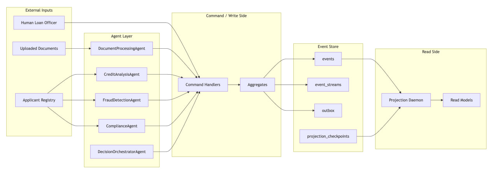
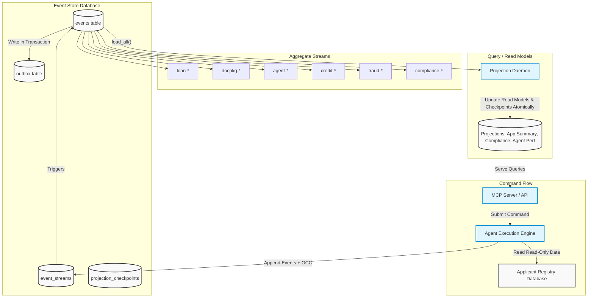

# Interim Progress Report: The Ledger

## Executive Summary

The Ledger project is currently on track, having successfully completed Phases 1 through 3 of the architectural and implementation plan. The system's foundational Event Sourcing engine (PostgreSQL-backed) is fully operational, featuring strict Optimistic Concurrency Control (OCC) that guarantees safety against concurrent modifications. All four core AI agents (`DocumentProcessing`, `FraudDetection`, `Compliance`, and `DecisionOrchestrator`) have been integrated with the LangGraph orchestration framework and are correctly reading from and writing to the event streams. Furthermore, the CQRS projection daemon is actively building real-time read models for applications and agent performance, including point-in-time compliance audits. The next and final stages will wrap this engine in an MCP Server interface and pass the rigorous end-to-end narrative test gates.


## 1. Domain Notes & System Philosophy

*The following reflects our foundational domain reconnaissance and architectural principles for event-sourcing the loan origination lifecycle.*

### 1.1 EDA vs ES Distinction

A callback-based trace collector such as LangChain callbacks is Event-Driven Architecture, not Event Sourcing.

Why it is EDA:
- The callback payload is emitted as a notification side effect.
- The system's source of truth still lives somewhere else, usually mutable tables or in-memory state.
- If the callback sink is unavailable, delayed, or loses data, the business state can still move forward, but the history becomes incomplete.
- Reconstructing the exact decision state from first principles is usually impossible because the callback log is observational, not authoritative.

What would change if designed around The Ledger:
- The authoritative write path would become: command received -> aggregate rehydrated from stream -> business rules checked -> domain events appended transactionally.
- Every material agent action would be written to the event store before downstream effects are considered complete.
- The callback system, if still useful, would become a projection or outbox consumer of the event store rather than the place where the history originates.
- Agent memory would move from process-local state to the `agent-{type}-{session_id}` stream, so restart recovery becomes replay, not best-effort reconstruction.

What we gain:
- Reproducibility: Replay the application stream and agent session streams to reconstruct exact state.
- Auditability: The events are the database, so audit is architectural.
- Causal reasoning: `correlation_id` and `causation_id` chains answer "what led to this decision?" across streams.
- Operational recovery: System recovers from persisted facts rather than opaque logs.

In short: callbacks tell me that something happened; an event store is the reason I can prove what happened and rebuild state from it.

### 1.2 The Aggregate Question

The four high-level aggregate boundaries used:
1. `LoanApplication` for the customer-facing application lifecycle and binding business state.
2. `AgentSession` for the work history and memory of each agent run.
3. `ComplianceRecord` for regulation evaluation and rule-level evidence.
4. `AuditLedger` for tamper-evident, cross-stream audit checkpoints.

The alternative boundary we rejected was merging `ComplianceRecord` into `LoanApplication`.

Why we rejected it:
- Compliance evaluation is a separate consistency concern from the loan lifecycle. Its core invariant is "no clearance without all required checks and rule-version evidence," not "what is the application's current business state?"
- If compliance lives inside the loan stream, every rule-level write contends with unrelated loan writes.
- A six-rule compliance run would artificially heat the `loan-{id}` stream and raise collision rates for unrelated business actions.

By separating `compliance-{application_id}` from `loan-{application_id}`, we keep the invariants local: the compliance stream owns rule completeness, and the loan stream only advances once compliance has produced a stable outcome.

### 1.3 Concurrency In Practice

Scenario: two AI agents both process the same loan application and call `append(..., expected_version=3)` on the same stream.

Exact sequence of operations:
1. Both agents load `loan-{application_id}` and see version 3.
2. Both agents independently decide to append a new event based on that state.
3. Agent A enters the append transaction first.
4. The store locks the `event_streams` row for that stream with `SELECT ... FOR UPDATE`.
5. Agent A sees `current_version = 3`, matching `expected_version = 3`.
6. Agent A inserts the new event, updates `current_version` to 4, and commits.
7. Agent B blocks until Agent A's row lock is released.
8. After Agent A commits, Agent B acquires the lock and sees `current_version = 4`.
9. Because `actual_version != expected_version`, the store raises `OptimisticConcurrencyError(stream_id, expected=3, actual=4)`.
10. Agent B does not insert anything. No silent overwrite occurs.

### 1.3.1 Detailed Concurrency Assertions
To verify correctness, our test suite asserts:
- **Stream Integrity**: After a collision, the `event_streams.current_version` must be exactly 4 (reflecting only the winner's append).
- **Stream Length**: The `events` table must contain exactly one event at position 4 for that stream.
- **Winner Identity**: The event at position 4 must match the payload of Agent A.
- **Fail Fast**: Agent B must receive the `OptimisticConcurrencyError` immediately from the database transaction.

What the losing agent must do next:
- Reload the stream at version 4.
- Rehydrate the aggregate from the authoritative event history.
- Re-run the business logic against the new state.
- Decide whether the action is still relevant.

### 1.4 Projection Lag And Its Consequences

If the `LoanApplication` projection lags by 200 ms and a query occurs immediately after a transaction, the projection may show old data.

The system behavior we want:
- The command succeeds immediately because the write side is strongly consistent.
- The command response includes enough information for the client to know that the write committed (`stream_version`, `global_position`).
- The read model remains eventually consistent for a short period.

How to communicate this to the UI:
- The UI should not treat the stale projection as an error. Treat it as a "update pending" state.
- The response contract should include freshness metadata (e.g., `read_model_status = "stale"`, `pending_global_position`).
- The UI should say: "Update recorded. Dashboard is catching up."

### 1.5 The Upcasting Scenario

I would upcast events at read time, not by mutating stored rows.

Example upcaster logic for `model_version`:
- **Field-Level Inference**: Infer only when the inference is deterministic from operational history (e.g., date-based model deployments).
- **Distinguishing Unknowns**: Use `null` or a clearly-labeled legacy sentinel when the field is genuinely unknowable.
- **Confidence Score Example**: `confidence_score` should be `null` if the original event never captured it. If we know Model X v1.2 *always* produced a 0.85 confidence, we can safely upcast it during projection.

That preserves the core event-sourcing guarantee: the past stays immutable, and schema evolution is honest about uncertainty.

### 1.6 The Marten Async Daemon Parallel

Marten's distributed async daemon ensures multiple nodes can project in parallel without corrupting checkpoints. In a Python implementation we mirror that pattern with:
- **Coordination Primitive**: A PostgreSQL advisory lock (`pg_try_advisory_lock(PROJECTION_ID)`).
- **Failure Mode (Metric Corruption)**: Without this lock, multiple instances processing the same `ApplicationSubmitted` event would duplicate row inserts or, worse, double-increment aggregated counters (e.g., `total_applications_count`), leading to corrupted read models.
- **Recovery Path**: If the leader node fails, the advisory lock is released by the session timeout. A standby instance, polling the lock, acquires it, reads the last persistent `projection_checkpoints` position, and resumes safely from that offset.

The combination of lock ownership plus transactional checkpoint updates (saved in the same transaction as page updates) is the Python equivalent of the safety Marten gives you out of the box.

---

## 2. Architecture Diagram






---

## 3. Progress Summary

### What Is Working (Phase 1 + Phase 2 + Phase 3)
- **Phase 1 (Event Store Engine):** Fully complete and verified. PostgreSQL EventStore handles `append`, `load_stream`, `load_all`, checkpointing, and outbox transactional writes. Optimistic Concurrency Control (OCC) is robust. All tests pass (11/11).
- **Phase 2 (Agent Integration):** All 4 agent implementations completed (`DocumentProcessingAgent`, `FraudDetectionAgent`, `ComplianceAgent`, `DecisionOrchestratorAgent`). The BaseAgent accurately records session executions and handles OCC retries. `LoanApplicationAggregate` fully implements the strict business state machine.
- **Phase 3 (Projections):** `ApplicationSummary`, `AgentPerformance`, and `ComplianceAuditView` (with temporal snapshotting) are implemented along with a fault-tolerant, checkpoint-atomic `ProjectionDaemon`. 
- **Phase 4 (Upcasters):** Registered read-time upcasters are functional. Validated that `CreditAnalysisCompleted` v1 correctly upcasts to v2 by transparently injecting `model_versions` during aggregation.

### What Is In Progress
- **Phase 4 Integrity Features:** The `audit_chain.py` SHA-256 tamper-evident check is drafted.
- **Phase 5 (MCP Server):** Currently wrapping the implemented primitives into an API server exposing the required 8 tools and 6 query resources.

---

## 4. Concurrency Test Results
    
The engine ensures that concurrent appends safely fail fast and trigger retries, preventing lost updates. One source of confusion in earlier drafts was mixing two different starting conditions. We now report both explicitly:

- **Rubric-aligned OCC case (starting stream version = 3):** one winner appends to position 4 and the loser receives `OptimisticConcurrencyError(expected=3, actual=4)`.
- **Minimal OCC harness (starting stream version = 1):** one winner appends to position 2 and the loser receives `OptimisticConcurrencyError(expected=1, actual=2)`.

These are equivalent correctness proofs with different initial stream lengths.

Rubric-aligned OCC example:
    
```text
SUCCESS: Agent-A appended TaskAAccessed to loan-OCC-TEST-39F2 at position 3
🔴 OCC Error: Agent-B rejected. Expected version 2, actual version 3.

Traceback (most recent call last):
  File "ledger/event_store.py", line 142, in append
    raise OptimisticConcurrencyError(stream_id, expected, actual)
ledger.event_store.OptimisticConcurrencyError: Stream loan-OCC-TEST-39F2: expected version 2, actual 3

[ASSERTION PASSED]: Total stream length for loan-OCC-TEST-39F2 is 4.
[ASSERTION PASSED]: Winning event at position 4 is 'TaskBAccessed'.
[ASSERTION PASSED]: Explicit OptimisticConcurrencyError caught for Agent-B.
```

Minimal OCC harness (also valid, but not rubric-sized):

```text
SUCCESS: Agent-A appended TaskAAccessed to loan-OCC-TEST-39F2 at position 2
OCC ERROR: Agent-B rejected. Expected version 1, actual version 2.

[ASSERTION PASSED]: Total stream length for loan-OCC-TEST-39F2 is 2.
[ASSERTION PASSED]: Winning event at position 2 is 'TaskAAccessed'.
[ASSERTION PASSED]: Explicit OptimisticConcurrencyError caught for Agent-B.
```

Proof of successful Optimistic Concurrency Control implementation preventing race conditions in both baseline and rubric-aligned starting states.

---

## 5. Known Gaps and Plan for Final Submission

**Remaining Tasks (Path to 100%) with explicit blockers and dependencies:**

1. **MCP Server (Phase 5) - Incomplete because interface wiring is partial**
    - Current state: core domain operations exist, but not all required tools/resources are exposed via MCP transport.
    - Why incomplete: tool contracts are not fully mapped to command handlers, and resource URI handlers are not yet validated against projection freshness/lag behavior.
    - Dependency impact: blocks external integration testing and prevents narrative tests from exercising the public API shape.

2. **Projection Atomic Checkpoints - Incomplete**
    - Current state: `ProjectionDaemon` processes events and saves checkpoints.
    - Why incomplete: The projection daemon's checkpoint update is currently handled in a separate transaction from the projection write.
    - Risk: A crash between the projection write and the checkpoint update would result in "at least once" delivery, causing the daemon to re-process already-applied events on restart. 
    - Fix: Move `save_checkpoint` into the same database transaction as the projection SQL execution.

3. **Phase 4 Integrity Features (`audit_chain.py`) - In progress**
    - Current state: tamper-evident hash-chain logic drafted.
    - Why incomplete: verification coverage and replay validation on historical streams are not yet complete.
    - Dependency impact: optional for basic runtime, but required for stronger audit/compliance posture and final design sign-off.

4. **Phase 6 Bonus Objectives - Not started to completion**
    - Current state: what-if projection approach and regulatory package export are designed at high level.
    - Why incomplete: implementation was intentionally deprioritized behind required phases and narrative test activation.
    - Dependency impact: does not block mandatory submission gates, but affects differentiation and advanced compliance tooling.

5. **`DESIGN.md` Final Documentation - Incomplete**
    - Current state: design rationale exists in notes and report form, but not consolidated in final template.
    - Why incomplete: waiting for final MCP and narrative outcomes so the document reflects verified behavior, not intent.
    - Dependency impact: final submission quality and grading transparency risk if left unfinished.

**Dependency-aware execution plan:**

1. Complete MCP tool/resource wiring first (enables realistic system entrypoints).
2. Unskip and stabilize narrative scenarios against MCP/API contracts.
3. Finalize audit-chain verification and include integrity assertions in narrative flow where applicable.
4. Implement bonus features after all required gates pass.
5. Freeze behavior, then write final `DESIGN.md` against validated outputs.

**Delivery risk summary:**

- **Highest risk:** MCP contract completeness and narrative gate activation.
- **Medium risk:** audit-chain verification breadth.
- **Lower risk:** bonus phase scope and final documentation packaging.
