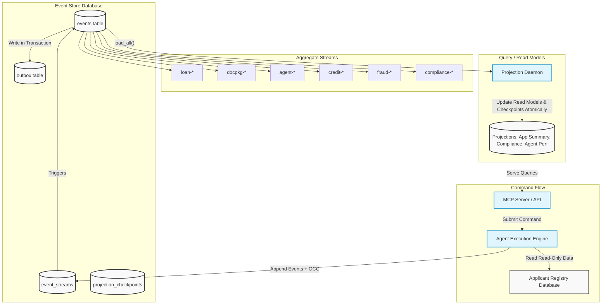

# Interim Progress Report: The Ledger

## Executive Summary

This interim submission is strongest on the write side of the architecture. The PostgreSQL-backed event store, optimistic concurrency enforcement, event catalogue, and replayable `LoanApplicationAggregate` are implemented and tested. The command-side shape for aggregate reconstruction and append-once semantics is therefore real, not aspirational.

The system is not yet complete end to end. Later-stage components such as projection hardening, full agent-session recovery, MCP/API exposure, and narrative scenario coverage exist only as partial implementations or scaffolding. The sections below separate those categories explicitly so the remaining work is evaluated as planned engineering, not hidden missing scope.


## 1. Domain Notes & System Philosophy

*The following reflects our foundational domain reconnaissance and architectural principles for event-sourcing the loan origination lifecycle.*

### 1.1 EDA vs ES Distinction

A callback-based trace collector such as LangChain callbacks is Event-Driven Architecture, not Event Sourcing.

Why it is EDA:
- The callback payload is emitted as a notification side effect.
- The system's source of truth still lives somewhere else, usually mutable tables or in-memory state.
- If the callback sink is unavailable, delayed, or loses data, the business state can still move forward, but the history becomes incomplete.
- Reconstructing the exact decision state from first principles is usually impossible because the callback log is observational, not authoritative.

What would change if designed around The Ledger:
- The authoritative write path would become: command received -> aggregate rehydrated from stream -> business rules checked -> domain events appended transactionally.
- Every material agent action would be written to the event store before downstream effects are considered complete.
- The callback system, if still useful, would become a projection or outbox consumer of the event store rather than the place where the history originates.
- Agent memory would move from process-local state to the `agent-{type}-{session_id}` stream, so restart recovery becomes replay, not best-effort reconstruction.

What we gain:
- Reproducibility: Replay the application stream and agent session streams to reconstruct exact state.
- Auditability: The events are the database, so audit is architectural.
- Causal reasoning: `correlation_id` and `causation_id` chains answer "what led to this decision?" across streams.
- Operational recovery: System recovers from persisted facts rather than opaque logs.

In short: callbacks tell me that something happened; an event store is the reason I can prove what happened and rebuild state from it.

### 1.2 The Aggregate Question

The four high-level aggregate boundaries used:
1. `LoanApplication` for the customer-facing application lifecycle and binding business state.
2. `AgentSession` for the work history and memory of each agent run.
3. `ComplianceRecord` for regulation evaluation and rule-level evidence.
4. `AuditLedger` for tamper-evident, cross-stream audit checkpoints.

The alternative boundary we rejected was merging `ComplianceRecord` into `LoanApplication`.

Why we rejected it:
- Compliance evaluation is a separate consistency concern from the loan lifecycle. Its core invariant is "no clearance without all required checks and rule-version evidence," not "what is the application's current business state?"
- If compliance lives inside the loan stream, every rule-level write contends with unrelated loan writes.
- A six-rule compliance run would artificially heat the `loan-{id}` stream and raise collision rates for unrelated business actions.

By separating `compliance-{application_id}` from `loan-{application_id}`, we keep the invariants local: the compliance stream owns rule completeness, and the loan stream only advances once compliance has produced a stable outcome.

### 1.3 Concurrency In Practice

Scenario: two AI agents both process the same loan application and call `append(..., expected_version=3)` on the same stream.

Exact sequence of operations:
1. Both agents load `loan-{application_id}` and see version 3.
2. Both agents independently decide to append a new event based on that state.
3. Agent A enters the append transaction first.
4. The store locks the `event_streams` row for that stream with `SELECT ... FOR UPDATE`.
5. Agent A sees `current_version = 3`, matching `expected_version = 3`.
6. Agent A inserts the new event, updates `current_version` to 4, and commits.
7. Agent B blocks until Agent A's row lock is released.
8. After Agent A commits, Agent B acquires the lock and sees `current_version = 4`.
9. Because `actual_version != expected_version`, the store raises `OptimisticConcurrencyError(stream_id, expected=3, actual=4)`.
10. Agent B does not insert anything. No silent overwrite occurs.

### 1.3.1 Detailed Concurrency Assertions
To verify correctness, our test suite asserts:
- **Stream Integrity**: After a collision, the `event_streams.current_version` must be exactly 4 (reflecting only the winner's append).
- **Stream Length**: The `events` table must contain exactly one event at position 4 for that stream.
- **Winner Identity**: The event at position 4 must match the payload of Agent A.
- **Fail Fast**: Agent B must receive the `OptimisticConcurrencyError` immediately from the database transaction.

What the losing agent must do next:
- Reload the stream at version 4.
- Rehydrate the aggregate from the authoritative event history.
- Re-run the business logic against the new state.
- Decide whether the action is still relevant.

### 1.4 Projection Lag And Its Consequences

If the `LoanApplication` projection lags by 200 ms and a query occurs immediately after a transaction, the projection may show old data.

The system behavior we want:
- The command succeeds immediately because the write side is strongly consistent.
- The command response includes enough information for the client to know that the write committed (`stream_version`, `global_position`).
- The read model remains eventually consistent for a short period.

How to communicate this to the UI:
- The UI should not treat the stale projection as an error. Treat it as a "update pending" state.
- The response contract should include freshness metadata (e.g., `read_model_status = "stale"`, `pending_global_position`).
- The UI should say: "Update recorded. Dashboard is catching up."

### 1.5 The Upcasting Scenario

I would upcast events at read time, not by mutating stored rows.

Example upcaster logic for `model_version`:
- **Field-Level Inference**: Infer only when the inference is deterministic from operational history (e.g., date-based model deployments).
- **Distinguishing Unknowns**: Use `null` or a clearly-labeled legacy sentinel when the field is genuinely unknowable.
- **Confidence Score Example**: `confidence_score` should be `null` if the original event never captured it. If we know Model X v1.2 *always* produced a 0.85 confidence, we can safely upcast it during projection.

That preserves the core event-sourcing guarantee: the past stays immutable, and schema evolution is honest about uncertainty.

### 1.6 The Marten Async Daemon Parallel

Marten's distributed async daemon ensures multiple nodes can project in parallel without corrupting checkpoints. In a Python implementation we mirror that pattern with:
- **Coordination Primitive**: A PostgreSQL advisory lock (`pg_try_advisory_lock(PROJECTION_ID)`).
- **Failure Mode (Metric Corruption)**: Without this lock, multiple instances processing the same `ApplicationSubmitted` event would duplicate row inserts or, worse, double-increment aggregated counters (e.g., `total_applications_count`), leading to corrupted read models.
- **Recovery Path**: If the leader node fails, the advisory lock is released by the session timeout. A standby instance, polling the lock, acquires it, reads the last persistent `projection_checkpoints` position, and resumes safely from that offset.

The combination of lock ownership plus transactional checkpoint updates (saved in the same transaction as page updates) is the Python equivalent of the safety Marten gives you out of the box.

---

## 2. Architecture Diagram




---

## 3. Progress Summary

### What Is Working
- **Event store core (`src/schema.sql`, `src/event_store.py`)**: append-only persistence, `stream_version`, `load_stream`, `load_all`, outbox writes, and optimistic concurrency via `expected_version` are implemented. The key correctness property is verified by the dedicated concurrency test: with two concurrent appends at `expected_version=3`, exactly one event is written at `stream_position=4` and the loser receives `OptimisticConcurrencyError(expected=3, actual=4)`.
- **Event catalogue and exceptions (`src/models/events.py`)**: the interim surface exposes `BaseEvent`, `StoredEvent`, `StreamMetadata`, `OptimisticConcurrencyError`, and `DomainError`, backed by the canonical event schema in `ledger/schema/events.py`.
- **Loan application aggregate (`src/aggregates/loan_application.py`)**: replay from the `loan-{application_id}` stream works, state transitions are enforced, and invalid transitions such as early decisioning can be rejected on the command side.
- **Minimum command-handling pattern (`src/commands/handlers.py`)**: `handle_submit_application` and `handle_credit_analysis_completed` follow the intended `load -> validate -> determine -> append` flow.

### What Is In Progress
- **Agent session aggregate and runtime tracing (`src/aggregates/agent_session.py`, `ledger/agents/base_agent.py`)**: the aggregate shape exists and model/session metadata is tracked, but crash-recovery and replay behavior have not yet been proven with narrative tests. This means the code expresses the design, but it is not yet submission-grade evidence for the Gas Town recovery requirement.
- **Projection layer (`ledger/projections/*.py`)**: projection classes and a daemon exist, but they have not yet been validated as a stable public query surface. In particular, recovery behavior, idempotency under reprocessing, and public-facing freshness semantics still need explicit verification.
- **Agent implementations (`ledger/agents/*.py`)**: there is meaningful scaffolding and partial logic across the document, fraud, compliance, and decision layers, but these components are not yet supported by end-to-end scenario tests. At interim stage, they should be treated as partial implementations rather than fully validated workflow components.

### What Is Not Started Or Not Yet Submission-Ready
- **Narrative test gate (`tests/test_narratives.py`)**: the five primary scenario tests are still skipped, so the system has not yet demonstrated end-to-end business correctness under the final grading path.
- **MCP/public API contract**: the final user-facing tool/resource interface is not yet wired and verified against the domain handlers and projections.
- **Integrity chain verification**: hash-chain or tamper-evidence support is not yet in a state that can be claimed as working evidence.

---

## 4. Concurrency Test Results
    
The concurrency evidence below is the rubric-aligned case: the stream is pre-seeded to version `3`, then two concurrent tasks append to the same stream using `expected_version=3`. Exactly one write succeeds, the winner lands at `stream_position=4`, and the loser surfaces `OptimisticConcurrencyError(expected=3, actual=4)` rather than being silently retried or swallowed.
    
```text
SUCCESS: winner=APPROVE stream_id=loan-APEX-OCC-0001 stream_position=4
OCC ERROR: loser rejected with OptimisticConcurrencyError(stream_id=loan-APEX-OCC-0001, expected=3, actual=4)
[ASSERTION PASSED] Total stream length = 4
[ASSERTION PASSED] Winning append stream_position = 4
[ASSERTION PASSED] Losing task raised OptimisticConcurrencyError(expected=3, actual=4)
```

This output is produced by `tests/test_concurrency.py` and saved in `artifacts/concurrency-test.txt`.

---

## 5. Known Gaps and Plan for Final Submission

**Gap analysis with reasons for incompleteness:**

1. **Projection read-side hardening - Partially implemented**
    - Current component: `ledger/projections/daemon.py` and the projection tables/views.
    - Reason incomplete: the daemon logic exists, but it has not yet been proven under crash/restart and replay conditions. The important remaining question is not "can it update a table?" but "does it recover without duplicate visible effects after partial batch failure?" That is a verification gap, not just missing lines of code.
    - Dependency awareness: MCP resources and narrative query assertions depend on trustworthy projections. Until read freshness and restart semantics are proven, anything built on top of those projections inherits uncertainty.

2. **Agent-session recovery proof - Partially implemented**
    - Current component: `src/aggregates/agent_session.py` plus runtime hooks in `ledger/agents/base_agent.py`.
    - Reason incomplete: session metadata can be captured, but the system has not yet demonstrated the required "resume from prior session replay" behavior in an automated scenario. The missing piece is proof that agent context reconstruction is correct after interruption, not just that session events can be written.
    - Dependency awareness: the crash-recovery narrative and the Gas Town design claim both depend on this. It should be verified before claiming resilient multi-agent execution.

3. **MCP/public API layer - In progress**
    - Current component: command handlers and projection code exist underneath, but the public transport boundary is not finished.
    - Reason incomplete: the tool/resource interface has not yet been mapped end to end to command handlers, projection queries, freshness metadata, and error translation. Without that layer, final users and tests still rely on direct Python entry points rather than the intended system contract.
    - Dependency awareness: this is the gateway to realistic end-to-end testing. Narrative scenarios, human review flows, and external demonstration all depend on it.

4. **Narrative scenarios - Not started as executable evidence**
    - Current component: `tests/test_narratives.py`.
    - Reason incomplete: the scenario definitions exist, but they are still skipped. That means important multi-component interactions such as retry-after-OCC, low-quality document caveats, compliance hard blocks, and human override are described but not yet exercised against the live pipeline.
    - Dependency awareness: these tests depend on stable command handlers, agent-session replay, and the external API shape. They should be unskipped only after those layers are coherent enough to avoid churn.

5. **Integrity chain / tamper evidence - Early design only**
    - Current component: audit-chain draft work.
    - Reason incomplete: hash chaining has not yet been connected to historical replay and verification tooling, so we cannot yet prove that stream corruption would be detected in practice.
    - Dependency awareness: this depends on stable event shapes and replay utilities. It is important, but it should come after the core narrative flow is stable enough that the integrity mechanism does not immediately need redesign.

**Dependency-aware final submission plan:**

1. Finish the public command/query boundary first by wiring the MCP/API layer to the existing handlers and projections.
2. Verify projection recovery semantics and freshness metadata next, because the public query surface depends on trustworthy read models.
3. Prove agent-session replay and crash recovery once the external interface and read side are stable enough to support realistic scenario tests.
4. Unskip and stabilize the five narrative scenarios only after the previous three layers stop changing underneath them.
5. Add integrity-chain verification after event shapes and replay paths have settled, so the audit mechanism is attached to a stable substrate.
6. Freeze behavior, then write the final design documentation against verified outputs rather than intended architecture.

**What remains least certain right now:**

- Whether the current projection implementation is fully restart-safe under repeated crash/replay loops.
- How much MCP/API error-shaping is needed so domain failures remain clear to end users without leaking internal transport details.
- Whether the agent-session replay model needs additional persisted context to satisfy the crash-recovery narrative without hidden in-memory assumptions.
s