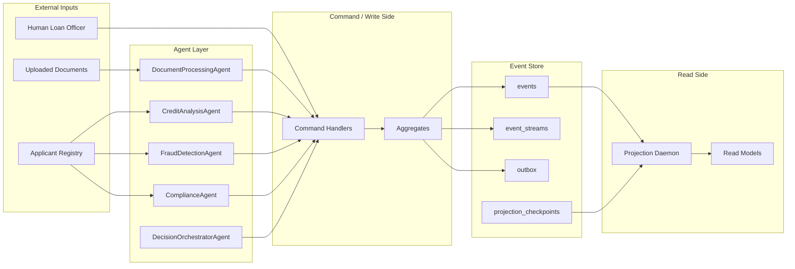

# The Ledger Architecture

## Overview
The Ledger is an event-sourced, multi-agent commercial loan decision platform.
PostgreSQL is the system of record. Every meaningful business action is written
as an immutable event before downstream effects occur.

## Diagram

## Aggregate Boundaries
- `loan-{application_id}`: top-level application lifecycle and final decisions
- `docpkg-{application_id}`: document ingestion, extraction, and quality checks
- `credit-{application_id}`: credit analysis outputs
- `fraud-{application_id}`: fraud screening outputs
- `compliance-{application_id}`: deterministic regulatory checks
- `agent-{agent_type}-{session_id}`: per-agent execution trace

## Command Flow
1. Load current aggregate state from the event store.
2. Validate command preconditions against replayed state.
3. Determine the next event or events.
4. Append with `expected_version` for optimistic concurrency.
5. Replay or project events downstream for read-side use.

## Distributed Projections
To scale read-side performance, the `ProjectionDaemon` can run across multiple instances.

### Failure Modes
- **Duplicate Writes / Metric Corruption**: If multiple instances process the same stream without coordination, they may perform redundant updates. While `ON CONFLICT` handles row-level idempotency for entities, aggregated metrics (e.g., `total_loan_volume`) can be corrupted if increments are applied multiple times for the same event.
- **Race Conditions**: Parallel processing of the same aggregate stream can lead to "out of order" row updates if a newer event finishes projecting before an older one.

### Recovery & Coordination
- **Leadership Election**: We use PostgreSQL advisory locks (`pg_try_advisory_lock`) to ensure only one daemon instance is active per projection group.
- **Recovery Path**: If a leader fails, the lock is released. A standby instance acquires the lock, reads the persistent `projection_checkpoints`, and resumes processing from the last known-good position.

## Upcasting Strategy
As the schema evolves, we use a **Field-Level Inference** strategy:
- **Versioning**: Each event includes a `model_version`.
- **Inference Rules**: Known old schemas (e.g., missing `risk_tier`) are upcast by inferring values from other fields (e.g., if `score > 800` then `tier = LOW`) or marking as `INFERRED_UNKNOWN` to distinguish from missing data.
- **Immutability**: The original event in the store remains unchanged; upcasting happens in-memory during replay or projection.
